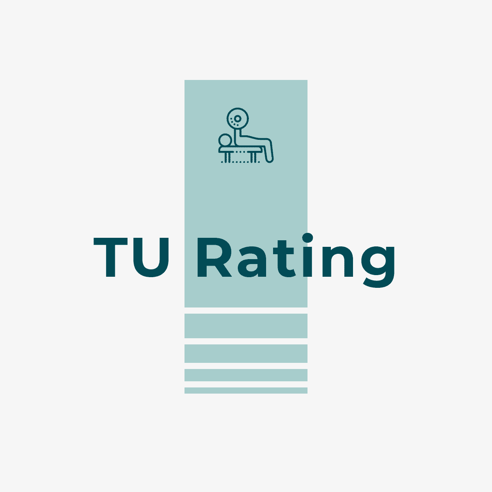

# TUDA-Rate
Rating system for modules offered by TU Darmstadt

  

### Table of Contents

1. [Installation](#installation)
2. [Project Motivation](#motivation)
3. [File Descriptions](#files)
4. [Licensing, Authors, and Acknowledgements](#licensing)

## Installation 

There should be no necessary libraries to run the code here beyond the Anaconda distribution of Python.  The code should run with no issues using Python versions 3.*.

## Project Motivation

We want to collect course reviews from students who have already taken this course, so we can make our decision whether to take it or not.

For this project, we are interested to know: 

1. How did you like the course? Give an overall rating.
2. What is the workload of this course, as far as exercises and the final exam?
3. How are the lecture and teaching staff?
4. What are the pros and cons of the course?
5. Do you recommend this course?

So far we have not seen any relevant apps that offers such information in German universities. Thus, we will consider turning it into a general purpose interface.

## File Descriptions 

TODO

## Licensing, Authors, Acknowledgements

TODO
